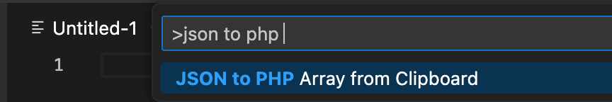

# JSON to PHP Array

Convert JSON to PHP Array.

## Features

Convert from clipboard

1. Open Command Palette.
2. Select `JSON to PHP Array from Clipboard` command.

## Release Notes

### 1.0.0

- Initial release.

### 1.1.1

- Fix: Insert code at the current cursor position.
- Fix: Improve conversion to avoid broken string values.

